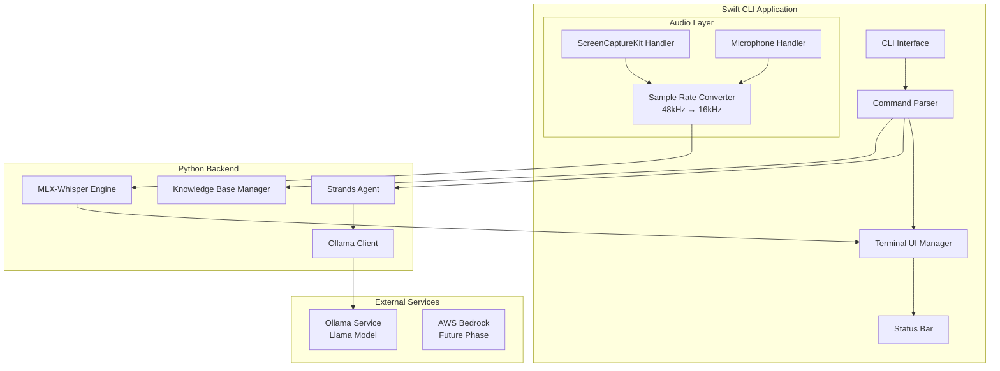

# Design Document: dev.echo Phase 1

## Overview

dev.echo Phase 1 is a CLI-based developer assistant that captures system audio and microphone input in real-time, transcribes them using local MLX-Whisper, and provides context-aware LLM assistance. The system is built with Swift for the CLI frontend and audio capture (ScreenCaptureKit), and Python with Strands Agent for LLM integration.

## Architecture

### CLI UI Layout (Claude Code Style)

```
┌──────────────────────────────────────────────────────────────────────────────────────────┐
│                                                                                          │
│  ▐▛███▜▌   dev.echo v1.0.0                                                               │
│   ▗▗ ▗▗    MLX-Whisper · Ollama/Llama                                                    │
│  ▐█████▌   ~/dev/project                                                                 │
│                                                                                          │
│                              Transcribing Mode · ctrl+q to exit                          │
│                                                                                          │
│══════════════════════════════════════════════════════════════════════════════════════════│
│                                                                                          │
│  🔊 [10:30:15] System Audio:                                                             │
│  ⎿  Let's discuss the API design for the new feature...                                 │
│                                                                                          │
│                                                                   🎤 [10:30:18] You:     │
│                                  ⎿  I think we should use REST for this endpoint...     │
│                                                                                          │
│  🔊 [10:30:25] System Audio:                                                             │
│  ⎿  Good point. What about authentication?                                              │
│                                                                                          │
│                                                                   🎤 [10:30:30] You:     │
│                                 ⎿  We could use JWT tokens with refresh mechanism...    │
│                                                                                          │
│  ✻ Processing for 2.3s                                                                   │
│                                                                                          │
│  🤖 LLM Response:                                                                        │
│  ⎿  Based on the discussion, here are the key points:                                   │
│     1. REST API design for the new feature                                              │
│     2. JWT authentication with refresh tokens                                           │
│     Consider adding rate limiting for security.                                         │
│                                                                                          │
│════════════════════════════════════════════════════════════════════════════════════════ │
│                                                                                          │
│❯ /chat What security considerations should we add?                                       │
│                                                                                          │
│──────────────────────────────────────────────────────────────────────────────────────── │
│  🎧 Headphone │ 🔊 Audio: ON │ 🎤 Mic: ON │ ✓ Permissions                                │
└──────────────────────────────────────────────────────────────────────────────────────────┘
```

### UI Components

1. **Header Area**: Logo, version, model info, current directory
2. **Mode Indicator**: Current mode with exit shortcut
3. **Transcript Area**: Scrollable area with timestamped entries
   - 🔊 System audio entries (from ScreenCaptureKit)
   - 🎤 Microphone entries (your voice)
   - 🤖 LLM responses (distinct styling)
   - ✻ Processing indicator (animated spinner)
4. **Input Area**: Command input with `❯` prompt
5. **Status Bar**: Audio/mic status, channel, permissions

### System Architecture



## Components and Interfaces

### 1. CLI Interface Component (Swift)

```swift
// Main application entry point and mode management
protocol CLIApplication {
    var currentMode: ApplicationMode { get }
    func run() async throws
    func shutdown() async
}

enum ApplicationMode {
    case command
    case transcribing
    case knowledgeBaseManagement
}

// Command parsing interface
protocol CommandParser {
    func parse(input: String) -> Command
}

enum Command {
    case new
    case managekb
    case quit
    case chat(content: String)
    case quick(content: String)
    case stop
    case save
    case list
    case remove(name: String)
    case update(fromPath: String, name: String)
    case add(fromPath: String, name: String)
    case unknown(input: String)
}
```

### 2. Terminal UI Manager (Swift)

```swift
// Terminal UI rendering and layout management (Claude Code style)
protocol TerminalUIManager {
    func render()
    func renderHeader()
    func renderModeIndicator(mode: ApplicationMode)
    func renderTranscriptArea()
    func renderInputArea()
    func renderStatusBar()
    
    func appendTranscript(entry: TranscriptEntry)
    func displayLLMResponse(response: String)
    func showProcessingIndicator(duration: TimeInterval)
    func hideProcessingIndicator()
    func showError(message: String)
    func promptSaveLocation() async -> URL?
    func clearScreen()
}

enum AudioSource {
    case system      // 🔊 System Audio
    case microphone  // 🎤 You
}

// Header component
struct HeaderView {
    let appName: String = "dev.echo"
    let version: String
    let modelInfo: String  // "MLX-Whisper · Ollama/Llama"
    let currentDirectory: String
    
    func render() -> String
}

// Status bar management
protocol StatusBarManager {
    var audioStatus: CaptureStatus { get set }
    var micStatus: CaptureStatus { get set }
    var currentChannel: AudioChannel { get set }
    var permissionStatus: PermissionStatus { get set }
    func render() -> String
}

enum CaptureStatus {
    case active    // ON (green)
    case inactive  // OFF (gray)
}

enum AudioChannel {
    case headphone  // 🎧
    case speaker    // 🔈
}

struct PermissionStatus {
    var screenCapture: Bool  // ✓ or ✗
    var microphone: Bool     // ✓ or ✗
}

// Processing indicator (animated spinner like Claude Code)
struct ProcessingIndicator {
    var isActive: Bool
    var startTime: Date?
    var message: String = "Processing"
    
    func render() -> String  // "✻ Processing for 2.3s"
}
```

### 3. Audio Capture Engine (Swift)

```swift
// ScreenCaptureKit-based audio capture
protocol AudioCaptureEngine {
    var delegate: AudioCaptureDelegate? { get set }
    func startCapture() async throws
    func stopCapture() async
    func checkPermissions() async -> PermissionStatus
    func requestPermissions() async -> Bool
}

protocol AudioCaptureDelegate: AnyObject {
    func didCaptureAudio(buffer: AudioBuffer, source: AudioSource)
    func didEncounterError(error: AudioCaptureError)
}

// Sample rate conversion
protocol SampleRateConverter {
    func convert(buffer: AudioBuffer, from: Int, to: Int) -> AudioBuffer
}

struct AudioBuffer {
    let samples: [Float]
    let sampleRate: Int
    let timestamp: Date
    let source: AudioSource
}

enum AudioCaptureError: Error {
    case permissionDenied
    case deviceNotAvailable
    case captureFailure(underlying: Error)
}
```

### 4. Transcription Engine Interface (Python)

```python
# MLX-Whisper transcription interface
from dataclasses import dataclass
from typing import AsyncIterator, Optional
from enum import Enum

class AudioSource(Enum):
    SYSTEM = "system"
    MICROPHONE = "microphone"

@dataclass
class TranscriptionResult:
    text: str
    source: AudioSource
    timestamp: float
    confidence: float

class TranscriptionEngine:
    """MLX-Whisper based transcription engine"""
    
    async def initialize(self) -> None:
        """Initialize the MLX-Whisper model"""
        pass
    
    async def transcribe(
        self, 
        audio_data: bytes, 
        source: AudioSource
    ) -> TranscriptionResult:
        """Transcribe audio data and return result"""
        pass
    
    async def stream_transcribe(
        self, 
        audio_stream: AsyncIterator[bytes],
        source: AudioSource
    ) -> AsyncIterator[TranscriptionResult]:
        """Stream transcription for real-time processing"""
        pass
    
    async def shutdown(self) -> None:
        """Clean up resources"""
        pass
```

### 5. LLM Integration (Python - Strands Agent)

```python
# Strands Agent with Ollama integration
from dataclasses import dataclass
from typing import List, Optional

@dataclass
class ConversationContext:
    transcript: List[TranscriptionResult]
    user_query: str

@dataclass
class LLMResponse:
    content: str
    model: str
    tokens_used: int

class LocalLLMAgent:
    """Strands Agent wrapper for Ollama/Llama"""
    
    def __init__(self, model_name: str = "llama3.2"):
        self.model_name = model_name
    
    async def initialize(self) -> None:
        """Initialize Strands Agent with Ollama provider"""
        pass
    
    async def query(
        self, 
        context: ConversationContext
    ) -> LLMResponse:
        """Send query with context to local LLM"""
        pass
    
    def is_available(self) -> bool:
        """Check if Ollama service is running"""
        pass
```

### 6. Knowledge Base Manager (Python)

```python
# Knowledge base document management
from dataclasses import dataclass
from typing import List
from pathlib import Path

@dataclass
class KBDocument:
    name: str
    path: Path
    size_bytes: int
    created_at: float
    updated_at: float

class KnowledgeBaseManager:
    """Manages knowledge base documents"""
    
    def __init__(self, kb_path: Path):
        self.kb_path = kb_path
    
    async def list_documents(self) -> List[KBDocument]:
        """List all documents in knowledge base"""
        pass
    
    async def add_document(
        self, 
        source_path: Path, 
        name: str
    ) -> KBDocument:
        """Add markdown document to knowledge base"""
        pass
    
    async def update_document(
        self, 
        source_path: Path, 
        name: str
    ) -> KBDocument:
        """Update existing document"""
        pass
    
    async def remove_document(self, name: str) -> bool:
        """Remove document by name"""
        pass
    
    def validate_markdown(self, path: Path) -> bool:
        """Validate file is markdown format"""
        pass
```

### 7. Inter-Process Communication

```swift
// Swift-Python IPC via Unix Domain Socket
protocol IPCClient {
    func connect() async throws
    func disconnect() async
    func sendAudioData(_ buffer: AudioBuffer) async throws
    func receiveTranscription() async throws -> TranscriptionMessage
    func sendLLMQuery(_ query: LLMQueryMessage) async throws
    func receiveLLMResponse() async throws -> LLMResponseMessage
}

struct TranscriptionMessage: Codable {
    let text: String
    let source: String
    let timestamp: Double
}

struct LLMQueryMessage: Codable {
    let type: String  // "chat" or "quick"
    let content: String
    let context: [TranscriptionMessage]
}

struct LLMResponseMessage: Codable {
    let content: String
    let model: String
}
```

## Data Models

### Transcript Data Model

```swift
struct Transcript {
    let id: UUID
    var entries: [TranscriptEntry]
    let startTime: Date
    var endTime: Date?
    
    func toMarkdown() -> String
}

struct TranscriptEntry {
    let timestamp: Date
    let source: AudioSource
    let text: String
    let isLLMResponse: Bool
}
```

### Configuration Model

```swift
struct AppConfiguration: Codable {
    var audioSettings: AudioSettings
    var llmSettings: LLMSettings
    var uiSettings: UISettings
}

struct AudioSettings: Codable {
    var inputSampleRate: Int = 48000
    var outputSampleRate: Int = 16000
    var bufferSize: Int = 4096
}

struct LLMSettings: Codable {
    var ollamaHost: String = "localhost"
    var ollamaPort: Int = 11434
    var modelName: String = "llama3.2"
}

struct UISettings: Codable {
    var systemAudioColor: String = "blue"      // 🔊 entries
    var microphoneColor: String = "green"      // 🎤 entries
    var llmResponseColor: String = "cyan"      // 🤖 responses
    var errorColor: String = "red"
    var processingColor: String = "yellow"     // ✻ indicator
    var separatorChar: String = "═"
}
```


## Correctness Properties

*A property is a characteristic or behavior that should hold true across all valid executions of a system—essentially, a formal statement about what the system should do. Properties serve as the bridge between human-readable specifications and machine-verifiable correctness guarantees.*

### Property 1: Command Parsing Consistency

*For any* valid command string input, the CommandParser SHALL return the correct Command enum variant with properly extracted parameters.

**Validates: Requirements 2.1, 2.2, 2.3, 3.3, 3.4, 3.5, 3.6, 3.7, 4.1, 4.2, 4.3, 4.4, 4.6**

### Property 2: Invalid Command Rejection

*For any* string that does not match a valid command pattern, the CommandParser SHALL return Command.unknown with the original input preserved.

**Validates: Requirements 2.4**

### Property 3: Mode Transition Correctness

*For any* valid mode-changing command executed in the appropriate mode, the application state SHALL transition to the expected target mode.

**Validates: Requirements 2.1, 2.2, 3.7, 4.6**

### Property 4: Transcript Entry Ordering

*For any* sequence of transcription events, the Transcript entries SHALL be ordered by timestamp in ascending order.

**Validates: Requirements 3.2**

### Property 5: Sample Rate Conversion Integrity

*For any* audio buffer captured at 48kHz, the converted 16kHz buffer SHALL have the correct number of samples (original_samples / 3) and maintain audio data integrity.

**Validates: Requirements 5.3**

### Property 6: Transcription Source Identification

*For any* transcription result, the source field SHALL correctly identify whether the audio came from system audio or microphone.

**Validates: Requirements 6.2**

### Property 7: Transcription Error Recovery

*For any* failed transcription attempt, the Transcription_Engine SHALL log the error and continue processing subsequent audio segments without crashing.

**Validates: Requirements 6.4**

### Property 8: LLM Context Inclusion

*For any* LLM query (chat or quick), the request SHALL include the current conversation transcript as context.

**Validates: Requirements 7.2**

### Property 9: Markdown Transcript Format

*For any* saved transcript, the output file SHALL be valid markdown containing timestamps and speaker identification for each entry.

**Validates: Requirements 8.2**

### Property 10: KB Document Validation

*For any* file path provided to the add operation, the system SHALL accept only files with .md extension and reject all others.

**Validates: Requirements 4.5**

### Property 11: KB Document Round-Trip

*For any* markdown document added to the knowledge base, listing documents SHALL include that document, and removing it SHALL result in it no longer appearing in the list.

**Validates: Requirements 4.1, 4.2, 4.4**

### Property 12: Status Bar Completeness

*For any* application state, the Status_Bar render output SHALL contain audio status, microphone status, current channel, and permission status information.

**Validates: Requirements 9.1, 9.2, 9.3, 9.4**

### Property 13: Status Update Reactivity

*For any* change in capture status, channel, or permissions, the Status_Bar SHALL reflect the new state on the next render call.

**Validates: Requirements 9.5**

## Error Handling

### Audio Capture Errors

| Error Type | Handling Strategy |
|------------|-------------------|
| Permission Denied | Display permission request dialog, update Status_Bar, prevent capture start |
| Device Not Available | Display error message, suggest checking audio settings |
| Capture Failure | Log error, attempt recovery, notify user if persistent |

### Transcription Errors

| Error Type | Handling Strategy |
|------------|-------------------|
| Model Load Failure | Display error, suggest checking MLX-Whisper installation |
| Transcription Timeout | Skip segment, log warning, continue with next segment |
| Invalid Audio Format | Log error, skip segment, continue processing |

### LLM Errors

| Error Type | Handling Strategy |
|------------|-------------------|
| Ollama Not Running | Display "Ollama service unavailable" message |
| Model Not Found | Display error with model name, suggest pulling model |
| Timeout | Display timeout message, allow retry |
| Context Too Large | Truncate oldest transcript entries, retry |

### File System Errors

| Error Type | Handling Strategy |
|------------|-------------------|
| Permission Denied | Display error with path, suggest checking permissions |
| Disk Full | Display error, suggest freeing space |
| Invalid Path | Display error with corrected path suggestion |
| File Not Found | Display error for KB operations |

### IPC Errors

| Error Type | Handling Strategy |
|------------|-------------------|
| Connection Failed | Attempt reconnection with exponential backoff |
| Message Timeout | Retry with timeout, notify user after max retries |
| Invalid Message Format | Log error, request resend |

## Testing Strategy

### Unit Testing

Unit tests focus on specific examples, edge cases, and error conditions:

- **Command Parser Tests**: Test each command variant with valid and invalid inputs
- **Sample Rate Converter Tests**: Test conversion accuracy with known audio samples
- **Markdown Formatter Tests**: Test transcript formatting with various entry types
- **KB Manager Tests**: Test file operations with mock file system

### Property-Based Testing

Property-based tests validate universal properties across randomly generated inputs. Each property test MUST:
- Run minimum 100 iterations
- Reference the design document property being tested
- Use tag format: **Feature: dev-echo-phase1, Property {number}: {property_text}**

**Testing Framework**: 
- Swift: SwiftCheck for property-based testing
- Python: Hypothesis for property-based testing

**Property Test Implementation**:

| Property | Test Description | Generator |
|----------|------------------|-----------|
| Property 1 | Generate random valid command strings, verify correct parsing | Valid command string generator |
| Property 2 | Generate random non-command strings, verify unknown result | Arbitrary string generator excluding valid commands |
| Property 3 | Generate mode transition sequences, verify state consistency | Mode and command sequence generator |
| Property 4 | Generate random transcript entries, verify ordering | Transcript entry generator with random timestamps |
| Property 5 | Generate audio buffers at 48kHz, verify conversion | Audio buffer generator |
| Property 6 | Generate transcription results, verify source field | Audio source and transcription generator |
| Property 7 | Simulate transcription failures, verify recovery | Error injection generator |
| Property 8 | Generate LLM queries with context, verify inclusion | Query and context generator |
| Property 9 | Generate transcripts, verify markdown validity | Transcript generator |
| Property 10 | Generate file paths with various extensions, verify validation | File path generator |
| Property 11 | Generate KB operations, verify round-trip consistency | Document operation generator |
| Property 12 | Generate application states, verify status bar content | Application state generator |
| Property 13 | Generate status changes, verify reactivity | Status change event generator |

### Integration Testing

- **Audio Pipeline**: Test ScreenCaptureKit → Converter → Transcription flow
- **LLM Pipeline**: Test Command → Strands Agent → Ollama → Response flow
- **IPC Communication**: Test Swift ↔ Python message exchange
- **End-to-End**: Test complete user workflows

### Test Environment Requirements

- macOS with ScreenCaptureKit support (macOS 12.3+)
- Ollama installed with Llama model
- MLX-Whisper installed
- Screen capture and microphone permissions granted for test runner
