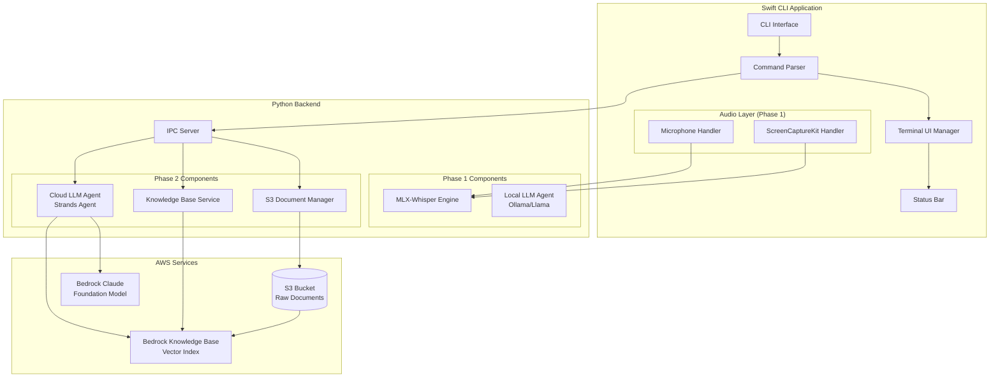
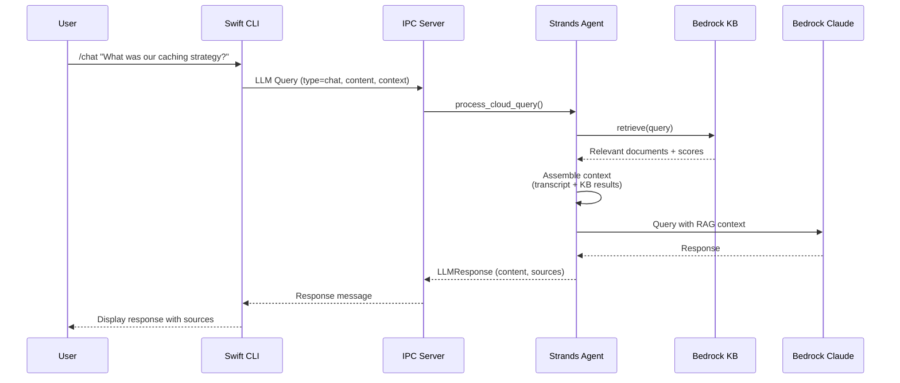
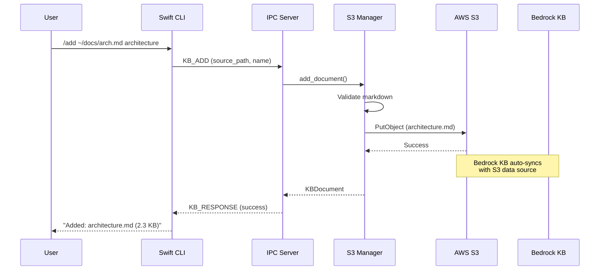

# Design Document: dev.echo Phase 2

## Overview

dev.echo Phase 2 extends the CLI-based developer assistant with cloud services and knowledge base capabilities. Building on Phase 1's local audio capture and transcription foundation, Phase 2 introduces:

1. **S3-based Document Storage**: Raw markdown documents stored in AWS S3
2. **Bedrock Knowledge Base Integration**: Automatic indexing and semantic search via AWS Bedrock Knowledge Base
3. **Cloud LLM with RAG**: AWS Bedrock Claude model with retrieval-augmented generation using Strands Agent

The architecture leverages AWS managed services (S3, Bedrock Knowledge Base) for document storage and semantic search, eliminating the need for local vector stores and embedding management.

## Architecture

### System Architecture



### Data Flow: Cloud LLM Query with RAG



### Data Flow: Document Management



## Components and Interfaces

### 1. S3 Document Manager (Python)

```python
"""
S3 Document Manager

Manages knowledge base documents stored in AWS S3.
Provides CRUD operations for markdown documents.
"""

from dataclasses import dataclass
from typing import List, Optional
from pathlib import Path
import boto3
from botocore.exceptions import ClientError


@dataclass
class S3Document:
    """Document metadata from S3."""
    name: str
    key: str
    size_bytes: int
    last_modified: float
    etag: str
    
    def to_dict(self) -> dict:
        return {
            "name": self.name,
            "key": self.key,
            "size_bytes": self.size_bytes,
            "last_modified": self.last_modified,
            "etag": self.etag,
        }


class S3DocumentManager:
    """
    Manages documents in S3 for Bedrock Knowledge Base.
    
    Requirements: 2.1, 3.1, 4.1, 5.1, 11.1-11.5
    """
    
    VALID_EXTENSIONS = {".md", ".markdown"}
    DEFAULT_PREFIX = "kb-documents/"
    
    def __init__(
        self,
        bucket_name: str,
        prefix: str = DEFAULT_PREFIX,
        region: str = "us-west-2"
    ):
        self.bucket_name = bucket_name
        self.prefix = prefix
        self.s3_client = boto3.client("s3", region_name=region)
    
    def validate_markdown(self, path: Path) -> bool:
        """Validate file is markdown format."""
        return path.suffix.lower() in self.VALID_EXTENSIONS
    
    async def list_documents(
        self,
        max_items: int = 20,
        continuation_token: Optional[str] = None
    ) -> tuple[List[S3Document], Optional[str]]:
        """
        List documents in S3 with pagination.
        
        Returns:
            Tuple of (documents, next_continuation_token)
        """
        pass
    
    async def add_document(
        self,
        source_path: Path,
        name: str
    ) -> S3Document:
        """Upload markdown document to S3."""
        pass
    
    async def update_document(
        self,
        source_path: Path,
        name: str
    ) -> S3Document:
        """Update existing document in S3."""
        pass
    
    async def remove_document(self, name: str) -> bool:
        """Remove document from S3."""
        pass
    
    async def document_exists(self, name: str) -> bool:
        """Check if document exists in S3."""
        pass
```

### 2. Knowledge Base Service (Python)

```python
"""
Knowledge Base Service

Manages Bedrock Knowledge Base operations including
sync status and semantic search.
"""

from dataclasses import dataclass
from typing import List, Optional
import boto3


@dataclass
class RetrievalResult:
    """Result from knowledge base retrieval."""
    content: str
    source: str
    score: float
    metadata: dict


@dataclass
class SyncStatus:
    """Knowledge base sync status."""
    status: str  # "SYNCING", "READY", "FAILED"
    last_sync: Optional[float]
    document_count: int
    error_message: Optional[str] = None


class KnowledgeBaseService:
    """
    Service for Bedrock Knowledge Base operations.
    
    Requirements: 7.1-7.5, 12.1-12.5
    """
    
    def __init__(
        self,
        knowledge_base_id: str,
        region: str = "us-west-2"
    ):
        self.knowledge_base_id = knowledge_base_id
        self.bedrock_agent = boto3.client(
            "bedrock-agent",
            region_name=region
        )
        self.bedrock_agent_runtime = boto3.client(
            "bedrock-agent-runtime",
            region_name=region
        )
    
    async def get_sync_status(self) -> SyncStatus:
        """Get current sync status of knowledge base."""
        pass
    
    async def start_sync(self) -> str:
        """
        Trigger knowledge base sync/reindexing.
        
        Returns:
            Ingestion job ID
        """
        pass
    
    async def retrieve(
        self,
        query: str,
        top_k: int = 5
    ) -> List[RetrievalResult]:
        """
        Retrieve relevant documents from knowledge base.
        
        Uses Bedrock Knowledge Base semantic search.
        """
        pass
    
    async def check_connectivity(self) -> bool:
        """Verify connection to Bedrock Knowledge Base."""
        pass
```

### 3. Cloud LLM Agents (Python - Strands Agent)

The system uses two separate agents for different query types:

1. **SimpleCloudAgent**: For transcript-only queries (no KB retrieval needed)
2. **RAGCloudAgent**: For queries requiring knowledge base retrieval

```python
"""
Cloud LLM Agents

Two Strands Agent implementations for AWS Bedrock:
1. SimpleCloudAgent - For transcript-based queries without KB retrieval
2. RAGCloudAgent - For queries requiring knowledge base retrieval

Reference: https://strandsagents.com/latest/documentation/docs/
Reference: https://strandsagents.com/latest/documentation/docs/examples/python/knowledge_base_agent/
"""

from dataclasses import dataclass, field
from typing import List, Optional
from enum import Enum
import os

from strands import Agent
from strands_tools import memory, use_llm


class QueryIntent(str, Enum):
    """Query intent classification."""
    SIMPLE = "simple"      # Transcript-only, no KB needed
    RAG = "rag"            # Requires KB retrieval


@dataclass
class TranscriptContext:
    """Single transcript entry for context."""
    text: str
    source: str  # "system" or "microphone"
    timestamp: float


@dataclass
class ConversationContext:
    """Context for cloud LLM queries."""
    transcript: List[TranscriptContext] = field(default_factory=list)
    user_query: str = ""
    
    def to_context_string(self) -> str:
        """Format transcript as context string."""
        if not self.transcript:
            return ""
        
        lines = ["## Recent Conversation\n"]
        for entry in self.transcript:
            source_label = "🔊 System" if entry.source == "system" else "🎤 You"
            lines.append(f"{source_label}: {entry.text}")
        
        return "\n".join(lines)


@dataclass
class CloudLLMResponse:
    """Response from cloud LLM with sources."""
    content: str
    model: str
    sources: List[str]  # Document names used (empty for simple queries)
    tokens_used: int = 0
    used_rag: bool = False


class SimpleCloudAgent:
    """
    Simple Strands Agent for transcript-based queries.
    
    Does NOT use knowledge base retrieval. Suitable for:
    - Summarizing current conversation
    - Answering questions based on transcript context only
    - General questions not requiring personal knowledge
    
    Requirements: 6.1, 6.2, 6.3
    """
    
    DEFAULT_MODEL = "us.anthropic.claude-sonnet-4-20250514-v1:0"
    
    def __init__(
        self,
        model_id: str = DEFAULT_MODEL,
        region: str = "us-west-2"
    ):
        self.model_id = model_id
        self.region = region
        self._agent: Optional[Agent] = None
        self._initialized = False
    
    async def initialize(self) -> None:
        """Initialize simple Strands Agent without KB tools."""
        if self._initialized:
            return
        
        system_prompt = self._get_system_prompt()
        
        # Create agent without memory tool (no KB access)
        self._agent = Agent(system_prompt=system_prompt)
        
        self._initialized = True
    
    def _get_system_prompt(self) -> str:
        """System prompt for simple cloud agent."""
        return """You are dev.echo, an AI assistant for developers.

You help with:
- Understanding and summarizing conversations
- Answering questions based on the current conversation context
- Providing general technical guidance

You are responding based on the conversation transcript provided.
Be concise and helpful. Focus on actionable information."""
    
    async def query(
        self,
        context: ConversationContext
    ) -> CloudLLMResponse:
        """
        Send query with transcript context only (no KB retrieval).
        """
        if not self._initialized:
            await self.initialize()
        
        # Build prompt with transcript context only
        prompt = self._build_prompt(context)
        
        # Execute via Strands Agent
        result = self._agent(prompt)
        
        return CloudLLMResponse(
            content=str(result),
            model=self.model_id,
            sources=[],  # No KB sources
            tokens_used=self._estimate_tokens(prompt, str(result)),
            used_rag=False
        )
    
    def _build_prompt(self, context: ConversationContext) -> str:
        """Build prompt with transcript context."""
        parts = []
        
        context_str = context.to_context_string()
        if context_str:
            parts.append(context_str)
            parts.append("\n---\n")
        
        parts.append(f"User Query: {context.user_query}")
        
        return "\n".join(parts)
    
    def _estimate_tokens(self, prompt: str, response: str) -> int:
        """Rough token estimation."""
        return len(prompt.split()) + len(response.split())
    
    async def shutdown(self) -> None:
        """Clean up resources."""
        self._agent = None
        self._initialized = False


class RAGCloudAgent:
    """
    RAG-enabled Strands Agent for knowledge base queries.
    
    Uses the `memory` tool from strands-agents-tools to query
    Bedrock Knowledge Base. The memory tool supports:
    - action="retrieve": Retrieve relevant documents from KB
    - action="store": Store information to KB (not used in this agent)
    
    Suitable for:
    - Questions requiring personal knowledge (past decisions, docs)
    - Technical questions about user's specific codebase/architecture
    - Queries mentioning "previous", "last time", "our", etc.
    
    Reference: https://strandsagents.com/latest/documentation/docs/examples/python/knowledge_base_agent/
    
    Requirements: 6.1-6.6, 7.1-7.5, 9.1-9.5, 10.1-10.5
    """
    
    DEFAULT_MODEL = "us.anthropic.claude-sonnet-4-20250514-v1:0"
    
    def __init__(
        self,
        knowledge_base_id: str,
        model_id: str = DEFAULT_MODEL,
        region: str = "us-west-2"
    ):
        self.knowledge_base_id = knowledge_base_id
        self.model_id = model_id
        self.region = region
        self._agent: Optional[Agent] = None
        self._initialized = False
    
    async def initialize(self) -> None:
        """
        Initialize Strands Agent with Bedrock and KB memory tool.
        
        Sets STRANDS_KNOWLEDGE_BASE_ID environment variable for memory tool.
        """
        if self._initialized:
            return
        
        # Set KB ID for strands memory tool
        os.environ["STRANDS_KNOWLEDGE_BASE_ID"] = self.knowledge_base_id
        
        system_prompt = self._get_system_prompt()
        
        # Create agent with memory tool for KB access
        self._agent = Agent(
            tools=[memory],
            system_prompt=system_prompt
        )
        
        self._initialized = True
    
    def _get_system_prompt(self) -> str:
        """System prompt for RAG cloud agent."""
        return """You are dev.echo, an AI assistant for developers.

You help with:
- Answering technical questions based on the user's knowledge base
- Surfacing relevant past context from documents
- Providing code suggestions based on user's architecture decisions

You have access to the user's personal knowledge base containing their documents,
architecture decisions, code snippets, and troubleshooting logs.

Use the memory tool with action="retrieve" to search the knowledge base.
Always cite your sources when using information from the knowledge base.

Be concise and helpful. Focus on actionable information.
When you use information from the knowledge base, mention which document it came from."""
    
    async def query(
        self,
        context: ConversationContext
    ) -> CloudLLMResponse:
        """
        Send query with context to cloud LLM via RAG pipeline.
        
        Uses code-defined workflow:
        1. Retrieve relevant documents from KB using memory tool
        2. Combine with conversation context
        3. Generate response
        """
        if not self._initialized:
            await self.initialize()
        
        # Step 1: Retrieve relevant documents from KB
        retrieval_result = self._agent.tool.memory(
            action="retrieve",
            query=context.user_query,
            min_score=0.4,
            max_results=5
        )
        
        # Step 2: Build context with transcript and retrieved docs
        full_context = self._build_full_context(context, retrieval_result)
        
        # Step 3: Generate response via agent
        response = self._agent(full_context)
        
        # Extract sources from retrieval result
        sources = self._extract_sources(retrieval_result)
        
        return CloudLLMResponse(
            content=str(response),
            model=self.model_id,
            sources=sources,
            tokens_used=self._estimate_tokens(full_context, str(response)),
            used_rag=True
        )
    
    def _build_full_context(
        self,
        context: ConversationContext,
        retrieval_result
    ) -> str:
        """Build full context with transcript and retrieved documents."""
        parts = []
        
        # Add conversation transcript
        context_str = context.to_context_string()
        if context_str:
            parts.append(context_str)
            parts.append("\n---\n")
        
        # Add retrieved documents
        if retrieval_result:
            parts.append("## Relevant Documents from Knowledge Base\n")
            parts.append(str(retrieval_result))
            parts.append("\n---\n")
        
        # Add user query
        parts.append(f"User Query: {context.user_query}")
        
        return "\n".join(parts)
    
    def _extract_sources(self, retrieval_result) -> List[str]:
        """Extract document sources from retrieval result."""
        sources = []
        # Parse sources from memory tool retrieval result
        if retrieval_result and hasattr(retrieval_result, 'sources'):
            sources = retrieval_result.sources
        return sources
    
    def _estimate_tokens(self, prompt: str, response: str) -> int:
        """Rough token estimation."""
        return len(prompt.split()) + len(response.split())
    
    async def shutdown(self) -> None:
        """Clean up resources."""
        self._agent = None
        self._initialized = False


class IntentClassifier:
    """
    Classifies query intent to route to appropriate agent.
    
    Uses a lightweight classification to determine if query
    requires KB retrieval or can be answered from transcript alone.
    """
    
    # Keywords indicating RAG is needed
    RAG_KEYWORDS = {
        "previous", "last time", "before", "earlier",
        "our", "we", "my", "document", "doc",
        "architecture", "design", "decision",
        "codebase", "repository", "repo",
        "remember", "recall", "mentioned",
    }
    
    def __init__(self, agent: Optional[Agent] = None):
        """
        Initialize classifier.
        
        Args:
            agent: Optional Strands Agent for LLM-based classification.
                   If None, uses keyword-based classification.
        """
        self._agent = agent
    
    def classify(self, query: str, context: ConversationContext) -> QueryIntent:
        """
        Classify query intent.
        
        Returns:
            QueryIntent.RAG if KB retrieval is needed
            QueryIntent.SIMPLE if transcript-only is sufficient
        """
        query_lower = query.lower()
        
        # Check for RAG keywords
        for keyword in self.RAG_KEYWORDS:
            if keyword in query_lower:
                return QueryIntent.RAG
        
        # Default to simple for general questions
        return QueryIntent.SIMPLE
    
    async def classify_with_llm(
        self,
        query: str,
        context: ConversationContext
    ) -> QueryIntent:
        """
        Use LLM for more accurate intent classification.
        
        Falls back to keyword-based if LLM unavailable.
        """
        if not self._agent:
            return self.classify(query, context)
        
        classification_prompt = f"""Classify this query intent:

Query: {query}

Is this query asking about:
A) Information from the user's personal knowledge base (past documents, decisions, code)
B) General question that can be answered from conversation context alone

Reply with only 'A' or 'B'."""
        
        try:
            result = self._agent(classification_prompt)
            if 'A' in str(result).upper():
                return QueryIntent.RAG
            return QueryIntent.SIMPLE
        except Exception:
            return self.classify(query, context)


class CloudLLMService:
    """
    Service layer that routes queries to appropriate agent.
    
    Manages both SimpleCloudAgent and RAGCloudAgent,
    routing queries based on intent classification.
    """
    
    def __init__(
        self,
        knowledge_base_id: str,
        model_id: str = RAGCloudAgent.DEFAULT_MODEL,
        region: str = "us-west-2"
    ):
        self.simple_agent = SimpleCloudAgent(model_id=model_id, region=region)
        self.rag_agent = RAGCloudAgent(
            knowledge_base_id=knowledge_base_id,
            model_id=model_id,
            region=region
        )
        self.classifier = IntentClassifier()
        self._initialized = False
    
    async def initialize(self) -> None:
        """Initialize both agents."""
        if self._initialized:
            return
        
        await self.simple_agent.initialize()
        await self.rag_agent.initialize()
        self._initialized = True
    
    async def query(
        self,
        context: ConversationContext,
        force_rag: bool = False
    ) -> CloudLLMResponse:
        """
        Process query, routing to appropriate agent.
        
        Args:
            context: Conversation context with query
            force_rag: If True, always use RAG agent
            
        Returns:
            CloudLLMResponse with content and sources
        """
        if not self._initialized:
            await self.initialize()
        
        # Classify intent
        if force_rag:
            intent = QueryIntent.RAG
        else:
            intent = self.classifier.classify(context.user_query, context)
        
        # Route to appropriate agent
        if intent == QueryIntent.RAG:
            return await self.rag_agent.query(context)
        else:
            return await self.simple_agent.query(context)
    
    def is_available(self) -> bool:
        """Check if cloud LLM is available."""
        try:
            import boto3
            client = boto3.client("bedrock-runtime", region_name=self.rag_agent.region)
            return True
        except Exception:
            return False
    
    async def shutdown(self) -> None:
        """Clean up resources."""
        await self.simple_agent.shutdown()
        await self.rag_agent.shutdown()
        self._initialized = False
```

### 4. Extended IPC Protocol (Python)

```python
"""
Extended IPC Protocol for Phase 2

Adds message types for cloud LLM and S3 operations.
"""

from dataclasses import dataclass, asdict
from enum import Enum
from typing import List, Optional
import json


class MessageType(str, Enum):
    """Extended message types for Phase 2."""
    
    # Phase 1 messages (unchanged)
    AUDIO_DATA = "audio_data"
    TRANSCRIPTION = "transcription"
    LLM_QUERY = "llm_query"
    LLM_RESPONSE = "llm_response"
    KB_LIST = "kb_list"
    KB_ADD = "kb_add"
    KB_UPDATE = "kb_update"
    KB_REMOVE = "kb_remove"
    KB_RESPONSE = "kb_response"
    KB_ERROR = "kb_error"
    PING = "ping"
    PONG = "pong"
    SHUTDOWN = "shutdown"
    
    # Phase 2: Cloud LLM messages
    CLOUD_LLM_QUERY = "cloud_llm_query"
    CLOUD_LLM_RESPONSE = "cloud_llm_response"
    CLOUD_LLM_ERROR = "cloud_llm_error"
    
    # Phase 2: S3 KB messages (extended)
    KB_LIST_RESPONSE = "kb_list_response"
    KB_SYNC_STATUS = "kb_sync_status"
    KB_SYNC_TRIGGER = "kb_sync_trigger"


@dataclass
class CloudLLMQueryMessage:
    """Cloud LLM query with RAG."""
    content: str
    context: List[dict]  # Transcript entries
    
    def to_ipc_message(self) -> "IPCMessage":
        return IPCMessage(
            type=MessageType.CLOUD_LLM_QUERY,
            payload=asdict(self)
        )


@dataclass
class CloudLLMResponseMessage:
    """Cloud LLM response with sources."""
    content: str
    model: str
    sources: List[str]  # Document names
    tokens_used: int = 0
    
    def to_ipc_message(self) -> "IPCMessage":
        return IPCMessage(
            type=MessageType.CLOUD_LLM_RESPONSE,
            payload=asdict(self)
        )


@dataclass
class KBListResponseMessage:
    """S3 document list with pagination."""
    documents: List[dict]
    has_more: bool
    continuation_token: Optional[str] = None
    
    def to_ipc_message(self) -> "IPCMessage":
        return IPCMessage(
            type=MessageType.KB_LIST_RESPONSE,
            payload=asdict(self)
        )


@dataclass
class KBSyncStatusMessage:
    """Bedrock KB sync status."""
    status: str  # "SYNCING", "READY", "FAILED"
    document_count: int
    last_sync: Optional[float] = None
    error_message: Optional[str] = None
    
    def to_ipc_message(self) -> "IPCMessage":
        return IPCMessage(
            type=MessageType.KB_SYNC_STATUS,
            payload=asdict(self)
        )
```

### 5. Swift CLI Extensions

```swift
// Extended Command enum for Phase 2
enum Command {
    // Phase 1 commands
    case new
    case managekb
    case quit
    case chat(content: String)  // Now routes to Cloud LLM
    case quick(content: String) // Still uses Local LLM
    case stop
    case save
    
    // KB Management commands
    case list
    case listMore(token: String)  // Pagination
    case remove(name: String)
    case update(fromPath: String, name: String)
    case add(fromPath: String, name: String)
    
    case unknown(input: String)
}

// Extended IPC Protocol for Swift
struct CloudLLMQueryMessage: Codable {
    let content: String
    let context: [TranscriptionMessage]
}

struct CloudLLMResponseMessage: Codable {
    let content: String
    let model: String
    let sources: [String]
    let tokensUsed: Int
}

struct KBListResponseMessage: Codable {
    let documents: [KBDocumentInfo]
    let hasMore: Bool
    let continuationToken: String?
}

struct KBDocumentInfo: Codable {
    let name: String
    let key: String
    let sizeBytes: Int
    let lastModified: Double
}
```

## Data Models

### Configuration Model

```python
@dataclass
class AWSConfig:
    """AWS configuration for Phase 2."""
    
    # AWS Configuration
    aws_region: str = "us-west-2"
    s3_bucket: str = ""
    s3_prefix: str = "kb-documents/"
    knowledge_base_id: str = ""
    
    # Model Configuration
    bedrock_model_id: str = "us.anthropic.claude-sonnet-4-20250514-v1:0"
    
    # RAG Configuration
    retrieval_top_k: int = 5
    context_max_tokens: int = 4000
    
    @classmethod
    def from_env(cls) -> "AWSConfig":
        """Load configuration from environment variables."""
        return cls(
            aws_region=os.getenv("AWS_REGION", "us-west-2"),
            s3_bucket=os.getenv("DEVECHO_S3_BUCKET", ""),
            s3_prefix=os.getenv("DEVECHO_S3_PREFIX", "kb-documents/"),
            knowledge_base_id=os.getenv("DEVECHO_KB_ID", ""),
            bedrock_model_id=os.getenv(
                "DEVECHO_BEDROCK_MODEL",
                "us.anthropic.claude-sonnet-4-20250514-v1:0"
            ),
        )
```

### Swift Configuration Extension

```swift
struct AWSConfiguration: Codable {
    var awsRegion: String = "us-west-2"
    var s3Bucket: String = ""
    var knowledgeBaseId: String = ""
    var bedrockModelId: String = "us.anthropic.claude-sonnet-4-20250514-v1:0"
}
```


## Correctness Properties

*A property is a characteristic or behavior that should hold true across all valid executions of a system—essentially, a formal statement about what the system should do. Properties serve as the bridge between human-readable specifications and machine-verifiable correctness guarantees.*

### Property 1: Mode Transition Round-Trip

*For any* application starting in Command_Mode, entering `/managekb` then `/quit` SHALL return the application to Command_Mode with identical state.

**Validates: Requirements 1.1, 1.2**

### Property 2: KB Command Validation in Mode

*For any* command string entered while in KB_Management_Mode, the command parser SHALL accept only `/list`, `/add`, `/update`, `/remove`, and `/quit` commands, rejecting all others with an error.

**Validates: Requirements 1.4**

### Property 3: S3 Document CRUD Round-Trip

*For any* valid markdown file, performing add → list → update → list → remove → list operations SHALL show the document present after add, updated after update, and absent after remove.

**Validates: Requirements 3.1, 4.1, 5.1, 11.1, 11.3, 11.4**

### Property 4: Markdown File Validation

*For any* file path with extension not in {.md, .markdown}, the add and update operations SHALL reject the file with an error message specifying valid extensions.

**Validates: Requirements 3.3**

### Property 5: Document List Alphabetical Sorting

*For any* set of documents in S3, the list operation SHALL return documents sorted alphabetically by name (case-insensitive).

**Validates: Requirements 2.3**

### Property 6: S3 Pagination Correctness

*For any* S3 bucket containing more than 20 documents, the list operation SHALL return at most 20 documents per page with a valid continuation token for subsequent pages, and iterating through all pages SHALL yield all documents exactly once.

**Validates: Requirements 2.4, 11.2**

### Property 7: Document Existence Validation

*For any* document name, add SHALL fail if document exists, update SHALL fail if document doesn't exist, and remove SHALL fail if document doesn't exist, each with appropriate error messages.

**Validates: Requirements 3.5, 4.3, 5.4**

### Property 8: RAG Context Assembly

*For any* cloud LLM query with conversation transcript, the assembled context SHALL include both the transcript entries and relevant documents retrieved from Bedrock Knowledge Base, with clear source attribution.

**Validates: Requirements 6.1, 6.4, 7.1, 9.1, 9.2, 9.4**

### Property 9: Retrieval Result Ranking

*For any* knowledge base query returning multiple results, the results SHALL be ordered by relevance score in descending order and limited to top-k results.

**Validates: Requirements 7.3**

### Property 10: Graceful Fallback Without KB Results

*For any* query where Bedrock Knowledge Base returns no relevant documents, the Strands Agent SHALL proceed with the query using only conversation context without error.

**Validates: Requirements 7.4**

### Property 11: Response Source Attribution

*For any* cloud LLM response that used knowledge base documents, the response SHALL include the list of source document names that contributed to the answer.

**Validates: Requirements 6.6, 8.5**

### Property 12: Context Truncation Priority

*For any* context assembly that exceeds token limits, truncation SHALL preserve recent conversation entries and highest-relevance documents over older/lower-relevance content.

**Validates: Requirements 8.3**

### Property 13: KB Sync Trigger on Document Removal

*For any* successful document removal from S3, the system SHALL trigger a Bedrock Knowledge Base sync job and report completion status.

**Validates: Requirements 5.2, 11.2**

### Property 14: Startup Connectivity Verification

*For any* application startup, the system SHALL verify Bedrock Knowledge Base connectivity and display sync status including document count.

**Validates: Requirements 11.3, 11.5**

## Error Handling

### S3 Errors

| Error Type | Handling Strategy |
|------------|-------------------|
| NoSuchBucket | Display error with bucket name, suggest checking configuration |
| AccessDenied | Display permission error, suggest checking IAM policies |
| NoSuchKey | Display "document not found" with available documents list |
| InvalidObjectState | Display error, suggest checking S3 object status |
| NetworkError | Display connection error, suggest checking network/VPN |

### Bedrock Knowledge Base Errors

| Error Type | Handling Strategy |
|------------|-------------------|
| ResourceNotFoundException | Display KB not found error, suggest checking KB ID |
| AccessDeniedException | Display permission error, suggest checking IAM policies |
| ThrottlingException | Implement exponential backoff, notify user of rate limit |
| ValidationException | Display validation error details |
| ServiceUnavailableException | Display service unavailable, suggest retry later |

### Bedrock LLM Errors

| Error Type | Handling Strategy |
|------------|-------------------|
| ModelNotReadyException | Display model loading message, retry after delay |
| ModelTimeoutException | Display timeout error, suggest shorter query |
| ModelErrorException | Display model error, suggest using /quick for local LLM |
| AccessDeniedException | Display permission error with setup instructions |
| ThrottlingException | Implement backoff, notify user |

### Credential Errors

| Error Type | Handling Strategy |
|------------|-------------------|
| NoCredentialsError | Display setup instructions for AWS credentials |
| ExpiredTokenException | Display token expired, suggest refreshing credentials |
| InvalidIdentityTokenException | Display invalid token error |

## Testing Strategy

### Unit Testing

Unit tests focus on specific examples, edge cases, and error conditions:

- **Command Parser Tests**: Test KB management commands with valid/invalid inputs
- **S3 Document Manager Tests**: Test CRUD operations with mocked S3 client
- **Markdown Validator Tests**: Test file extension validation
- **Context Assembly Tests**: Test context formatting and truncation

### Property-Based Testing

Property-based tests validate universal properties across randomly generated inputs. Each property test MUST:
- Run minimum 100 iterations
- Reference the design document property being tested
- Use tag format: **Feature: dev-echo-phase2, Property {number}: {property_text}**

**Testing Framework**:
- Python: Hypothesis for property-based testing
- Swift: SwiftCheck for property-based testing (if needed)

**Property Test Implementation**:

| Property | Test Description | Generator |
|----------|------------------|-----------|
| Property 1 | Generate mode transition sequences, verify round-trip | Mode command sequence generator |
| Property 2 | Generate random commands in KB mode, verify acceptance/rejection | Command string generator |
| Property 3 | Generate markdown files, perform CRUD cycle, verify state | Markdown file content generator |
| Property 4 | Generate file paths with various extensions, verify validation | File path generator with extensions |
| Property 5 | Generate document lists, verify alphabetical order | Document name generator |
| Property 6 | Generate large document sets, verify pagination completeness | Document set generator (>20 items) |
| Property 7 | Generate existence scenarios, verify error handling | Document existence state generator |
| Property 8 | Generate queries with context, verify assembly | Query and transcript generator |
| Property 9 | Generate retrieval results, verify ranking | Retrieval result generator with scores |
| Property 10 | Generate queries with empty KB results, verify fallback | Empty result scenario generator |
| Property 11 | Generate responses with sources, verify attribution | Response with sources generator |
| Property 12 | Generate large contexts, verify truncation priority | Large context generator |
| Property 13 | Generate removal operations, verify sync trigger | Document removal generator |
| Property 14 | Generate startup scenarios, verify connectivity check | Startup state generator |

### Integration Testing

- **S3 Integration**: Test actual S3 operations with test bucket
- **Bedrock KB Integration**: Test retrieval with test knowledge base
- **Bedrock LLM Integration**: Test query/response with actual model
- **End-to-End RAG**: Test complete query flow from CLI to response

### Test Environment Requirements

- AWS account with Bedrock access enabled
- S3 bucket for test documents
- Bedrock Knowledge Base configured with test data source
- Claude model access enabled in Bedrock
- AWS credentials configured (via environment or AWS CLI)

### Mocking Strategy

For unit tests, use mocks for AWS services:

```python
# Example: Mocking S3 client
from unittest.mock import MagicMock, patch
import pytest

@pytest.fixture
def mock_s3_client():
    with patch('boto3.client') as mock:
        client = MagicMock()
        mock.return_value = client
        yield client

# Example: Mocking Bedrock KB retrieval
@pytest.fixture
def mock_bedrock_agent_runtime():
    with patch('boto3.client') as mock:
        client = MagicMock()
        client.retrieve.return_value = {
            'retrievalResults': [
                {
                    'content': {'text': 'Test content'},
                    'location': {'s3Location': {'uri': 's3://bucket/doc.md'}},
                    'score': 0.95
                }
            ]
        }
        mock.return_value = client
        yield client
```

